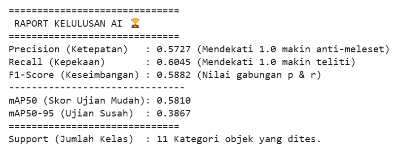

# 🔥 Fire Detection System
### Kelompok 2 — XI RPL 3

## 👥 Anggota Kelompok
- Desvita Adhayanti
- Melinnda
- Tiara Rahadatul Aisy

---

# 📌 Identitas dan Pengantar

## 📖 Deskripsi Project
Fire Detection System merupakan sebuah sistem berbasis Artificial Intelligence (AI) yang dirancang untuk mendeteksi keberadaan api secara real-time melalui kamera. Sistem ini memanfaatkan teknologi Computer Vision dan Deep Learning untuk mengenali objek api dengan cepat dan akurat.

Project ini dibuat sebagai implementasi pembelajaran AI pada bidang keamanan dan keselamatan lingkungan.

## 🎯 Use Case / Permasalahan yang Diselesaikan
Kebakaran sering kali terlambat disadari karena keterbatasan pengawasan manusia. Keterlambatan penanganan dapat menyebabkan kerusakan besar, kerugian material, hingga membahayakan keselamatan jiwa.

Melalui sistem Fire Detection ini, proses pendeteksian api dapat dilakukan secara otomatis dan real-time sehingga dapat membantu:

- Mengurangi risiko keterlambatan deteksi kebakaran
- Membantu monitoring area tertentu secara otomatis
- Memberikan peringatan dini terhadap potensi kebakaran
- Mendukung sistem keamanan berbasis AI pada lingkungan sekolah, rumah, maupun industri

---

# 🧠 Arsitektur Model

## 🔍 Model yang Digunakan
Project ini menggunakan model **YOLOv11n (You Only Look Once Version 11 Nano)** sebagai model utama dalam pendeteksian api.

## ⚡ Alasan Menggunakan YOLOv11n
YOLOv11n dipilih karena memiliki beberapa keunggulan, antara lain:

- ⚡ Ringan dan cepat untuk proses inferensi
- 💻 Cocok digunakan pada edge devices atau perangkat dengan spesifikasi terbatas
- 🎯 Mampu melakukan deteksi objek secara real-time
- 📈 Memiliki performa yang cukup baik meskipun ukuran model kecil

## ⚙️ Cara Kerja Sistem
1. Kamera menangkap video secara real-time
2. Frame video diproses oleh model YOLOv11n
3. Model mendeteksi keberadaan api
4. Sistem menampilkan hasil deteksi berupa bounding box dan confidence score

---

# 🌐 Akses Deployment

Project deployment dapat diakses melalui link berikut:

👉 https://araheiji4ever-lab.github.io/fire-detection/

---

# 📊 Hasil Evaluasi Model

Model Fire Detection dievaluasi menggunakan beberapa metrik performa untuk mengukur tingkat ketepatan dan kepekaan model dalam mendeteksi api secara real-time.

| Metric | Hasil |
|---|---|
| Precision | 0.5727 |
| Recall | 0.6045 |
| F1-Score | 0.5882 |
| mAP50 | 0.5810 |
| mAP50-95 | 0.3867 |

## 📖 Penjelasan Metric
- **Precision** → Mengukur seberapa tepat model saat mendeteksi api.
- **Recall** → Mengukur kemampuan model menemukan seluruh objek api.
- **F1-Score** → Nilai keseimbangan antara Precision dan Recall.
- **mAP50** → Tingkat akurasi deteksi pada threshold standar.
- **mAP50-95** → Evaluasi akurasi yang lebih ketat dan kompleks.

## 📷 Screenshot Evaluation Report

---

# 🛠️ Teknologi yang Digunakan

- Python
- YOLOv11n
- OpenCV
- HTML
- CSS
- JavaScript
- GitHub Pages

---

## 📷 Tampilan Sistem

# 🚀 Kesimpulan

Fire Detection System berhasil diimplementasikan menggunakan model YOLOv11n untuk mendeteksi api secara real-time. Sistem ini diharapkan dapat membantu meningkatkan keamanan melalui teknologi AI yang cepat, ringan, dan efisien.

---

# 📄 Lisensi

Project ini dibuat untuk kebutuhan pembelajaran dan pengembangan teknologi AI.
